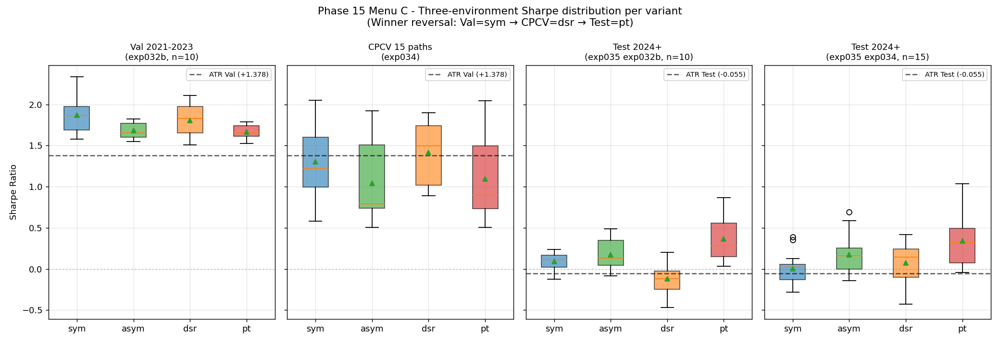
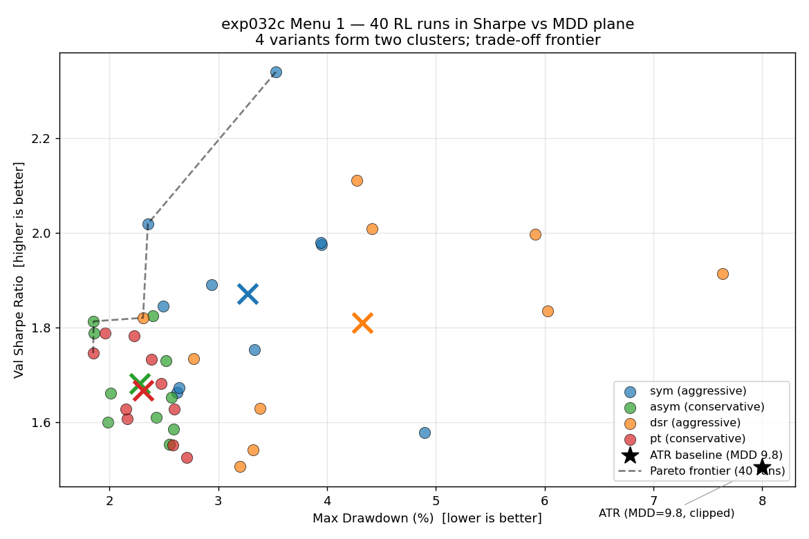
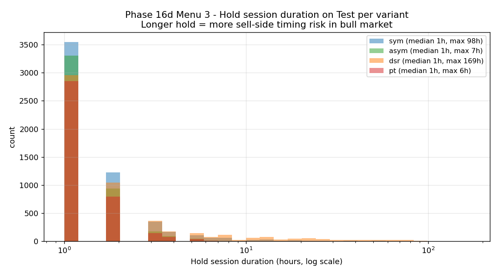
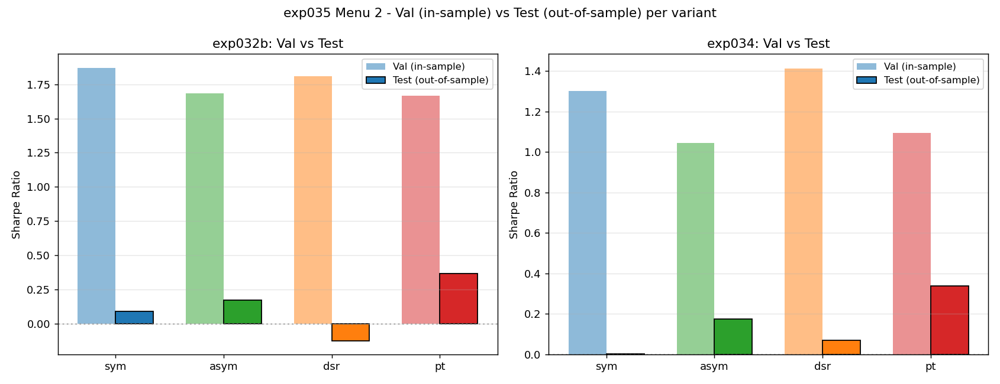
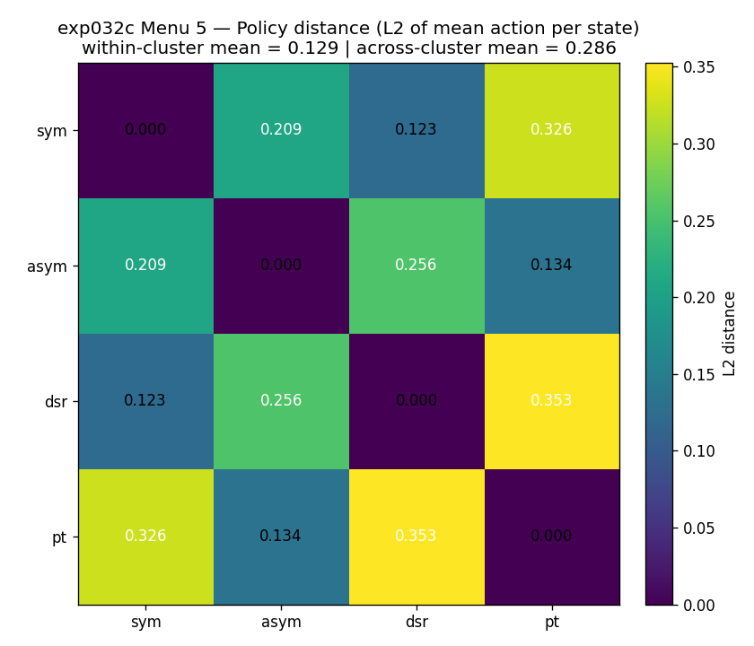

# The Effect of Reward Function Design in RL-Based BTC Grid Trading

> **Pareto Frontier, Winner Reversal, and OOS Robustness of Prospect-Theoretic Reward**
>
> Bachelor's Thesis · Capstone Design Project · June 2026
> Chanhee Lee · Department of Computer Science · Seoul National University of Science and Technology

[](LICENSE)
[](paper/LICENSE)
[](paper/main.pdf)
[](paper/main_ko.pdf)

---

## TL;DR

We quantitatively study the effect of **reward function design** on PPO-based
reinforcement-learning policies for ATR-proportional grid trading on the BTC/USDT
1-hour market. Four reward variants are each trained with **10 seeds × 1M steps**
and evaluated on **three environments**: single-split validation, 6-fold
combinatorial purged cross-validation (CPCV, 15 paths), and the unsealed
out-of-sample Test set (2024–2026, BTC \$42K → \$75K bull regime).

**Key finding:** the winner **reverses across evaluation environments** —
Val=`sym` → CPCV=`dsr` → Test=`pt` — and **prospect-theoretic reward (`pt`)**
is the only variant that achieves a consistent positive Sharpe on out-of-sample
data, providing quantitative evidence that Kahneman–Tversky prospect theory
confers OOS safety on RL trading policies.



---

## 📚 Quick Links

| Resource | Description |
|---|---|
| 📄 [Paper (English, 46p)](paper/main.pdf) | Final thesis, full method + results |
| 📄 [Paper (한국어, 43p)](paper/main_ko.pdf) | 한국어판 |
| 📖 [Reading Guide](https://cosmicpotato2047.github.io/capstone-rl-trading/paper/reading_guide.html) | Section-by-section roadmap (interactive HTML) |
| 🗺️ [Knowledge Map](https://cosmicpotato2047.github.io/capstone-rl-trading/reports/semester1/week11_knowledge_map.html) | RL × Finance prerequisites concept map (interactive HTML) |
| 🎯 [Research Question](docs/PROJECT_GOAL.md) | RQ, hypotheses, scenario branches |
| 📊 [Results Summary](docs/RESULTS_SUMMARY.md) | All numerical results, 1-page reference |
| 📓 [Research Log](RESEARCH_LOG.md) | Dated decisions and per-experiment logs |

> The interactive HTML files (Reading Guide, Knowledge Map) are served via
> GitHub Pages and open directly in the browser. Local copies are also in
> `paper/reading_guide.html` and `reports/semester1/week11_knowledge_map.html`.

---

## Key Findings

### 1. Scenario D — Pareto-frontier discovery
Four reward variants partition into two clusters {`sym`, `dsr`} (aggressive)
vs. {`asym`, `pt`} (conservative) on the Sharpe–MDD plane, with **no single
Sharpe winner**. Within-cluster Cohen's $|d| < 0.30$ versus across-cluster
$|d| > 0.79$ (Section 5).

### 2. Three-environment winner reversal
- **Val** (single-split): `sym` $= 1.871$
- **CPCV** (multi-split): `dsr` $= 1.413$ ($p < 10^{-9}$, Bonferroni 4-way corrected)
- **Test** (out-of-sample): `pt` $= 0.367 / 0.339$ (consistent across two model sources, $p < 0.002$)

The winner reverses completely across the three evaluation environments
(Section 7).

### 3. H5 — Prospect Theory confers OOS safety on RL policies
Trajectory analysis shows that `pt`'s loss aversion ($\lambda = 3.30$) and
concave gain ($\alpha = 0.68$) train policies to exit within mean **1.4 h
(max 6 h)**, avoiding sell-side timing risk in the unseen bull regime. In
contrast, `dsr` learns long holding (mean 4.58 h, max 169 h = 7 days) and
records the worst OOS performance — the same reward formulation simultaneously
drives both in-sample advantage and OOS failure (Section 7.3).

### 4. Methodological recommendation
Single-split Val + multi-split CPCV + out-of-sample Test are **jointly
required**; in-sample diversity (CPCV) does not guarantee OOS consistency
(Section 8.3).

---

## Selected Figures

### Pareto frontier on Val (Scenario D)
40 runs (4 variants × 10 seeds) form two clusters on the Sharpe–MDD plane;
5 runs are Pareto-optimal.



### Mechanism — Hold duration on Test
DSR learns long holding (max 7 days) while `pt` exits within 6 hours,
explaining the OOS reversal.



### Val → Test generalization gap
All variants degrade by ~1.5 Sharpe; `pt`'s gap is the smallest
(−0.75 to −1.30); `asym` and `pt` are the only variants achieving positive
Test Sharpe with statistical significance.



### Cluster preservation via policy distance
Within-cluster $L_2$ distance 0.129 vs. across-cluster 0.286 (ratio
$2.22\times$) quantifies the two-cluster separation at the policy level.



---

## Repository Structure

```
capstone-rl-trading/
├── paper/                         # Final thesis (LaTeX)
│   ├── main.tex / main.pdf            # English (45 pages)
│   ├── main_ko.tex / main_ko.pdf      # Korean (43 pages)
│   ├── references.bib
│   ├── READING_GUIDE.md / reading_guide.html
│   ├── figures/, guide_figures/, presentation_prep/
│   └── archive/                       # v1 drafts
├── docs/                          # Design + reference documents
│   ├── PROJECT_GOAL.md                # RQ, hypotheses, scope
│   ├── PAPER_OUTLINE.md               # 9-chapter outline
│   ├── RESULTS_SUMMARY.md             # 1-page numerical reference
│   ├── MDP.md, FORMULAS.md, ENV_HISTORY.md, RELATED_WORK.md
│   └── study/                         # Learning notes (rl_finance/, etc.)
├── src/                           # Production code
│   ├── env/                           # trading_env.py (Env-v4 canonical)
│   ├── agents/                        # PPO agent + baselines
│   ├── evaluation/                    # Metrics + behavior analysis
│   └── utils/                         # Config loader
├── scripts/                       # Command-line entry points
│   ├── train/, analyze/, tune/, data/, build/
├── config/                        # YAML experiment configs (exp030 ~ exp035)
├── experiments/
│   ├── archive/                       # Phase 1-2 (exp001 ~ exp031), outdated
│   └── exp032b ~ exp035/              # Main paper experiments
├── reports/
│   ├── exp032b ~ phase16d/            # Per-experiment analysis.md + figures/
│   └── semester1/                     # Weekly presentations (week02 ~ week11)
├── tests/                         # 46 environment unit tests
├── data/                          # processed/ (parquet, gitignored)
├── CLAUDE.md                      # Project briefing for Claude Code agents
├── README.md                      # This file
├── RESEARCH_LOG.md                # Dated decisions, per-experiment 6-section logs
├── ROADMAP.md                     # Phase status
├── CITATION.cff                   # Citation metadata
└── LICENSE                        # MIT (code); paper/LICENSE for CC BY 4.0
```

---

## Reproduction

### Environment

- Python 3.13 (any 3.11+ works)
- Dependencies: `pip install -r requirements.txt` or use `pyproject.toml`
- Core: `stable-baselines3==2.8.0`, `gymnasium==1.2.3`, `optuna==4.8.0`,
  `pandas`, `numpy`, `matplotlib`, `scipy`

### Data

```bash
python scripts/data/download_data.py     # ccxt Binance API, BTC/USDT 1h
python scripts/data/preprocess_data.py   # adds ATR, log_price, z-scores
# → data/processed/btc_{train,val,test}.parquet
```

Train 2017-08 ~ 2020-12 / Val 2021-01 ~ 2023-12 / Test 2024-01 ~
(sealed until §7.3).

### Train (4 reward variants × 10 seeds × 1M steps, ≈ 3.5 h)

```bash
# §3.5 — Optuna hyperparameter tuning for each variant (~2 h)
python scripts/tune/tune_reward_optuna.py

# §5 — main comparison
python scripts/train/run_exp032b.py
```

### Analyze (mechanism, §6)

```bash
# §6 — trajectory collection (5 min) + 5-menu mechanism analysis
python scripts/analyze/run_exp032c_eval.py \
    --eval-data data/processed/btc_val.parquet \
    --out experiments/exp032c_trajectories.parquet
python scripts/analyze/analyze_exp032c.py
```

### Robustness (§7)

```bash
# §7.1 Slippage 0.02%
python scripts/train/run_exp032b.py \
    --config-tmpl "config/exp033_{variant}_config.yaml" \
    --csv experiments/exp033_summary.csv --exp-tag exp033

# §7.2 CPCV 6-fold (15 paths × 4 variants, ≈ 5 h)
python scripts/train/run_exp034_cpcv.py

# §7.3 Final OOS test set (single-shot, ≈ 20 min)
python scripts/train/run_exp035_test.py
python scripts/analyze/analyze_exp035.py
```

### Build paper

```bash
cd paper
xelatex main_ko.tex && bibtex main_ko && xelatex main_ko.tex && xelatex main_ko.tex
pdflatex main.tex   && bibtex main    && pdflatex main.tex   && pdflatex main.tex
```

---

## Honest Limitations

The paper's §8.5 documents the following limitations transparently:

- **BTC single asset.** Multi-asset extension is explicitly out of scope.
- **Single OOS regime.** Test (2024–2026) is a BTC bull market only; bear
  or sideways regimes are not evaluated.
- **Single slippage level (0.02%).** Slippage sensitivity scan and full
  Domain Randomization are deferred to future work.
- **1M training steps per seed.** Longer training may shift winner reversal
  patterns.
- **Phase 2 prior evidence (exp027_rl, Env-v3, Test Sharpe 1.955) is not
  reproduced** on the canonical Env-v4 environment, demonstrating that
  environment dependence exceeds reward-variant effect in absolute alpha.

---

## 📑 Citation

If you use this work, please cite:

```bibtex
@thesis{lee2026reward,
  author  = {Lee, Chanhee},
  title   = {The Effect of Reward Function Design in RL-Based BTC Grid Trading:
             Pareto Frontier, Winner Reversal, and OOS Robustness of
             Prospect-Theoretic Reward},
  school  = {Seoul National University of Science and Technology},
  type    = {Bachelor's thesis},
  year    = {2026},
  month   = jun,
  url     = {https://github.com/cosmicpotato2047/capstone-rl-trading}
}
```

Or use the GitHub "Cite this repository" button (powered by
[`CITATION.cff`](CITATION.cff)).

---

## License

- **Code** (`src/`, `scripts/`, `tests/`, `config/`): [MIT License](LICENSE)
- **Paper, figures, and documentation** (`paper/`, `docs/`, `reports/`):
  [Creative Commons Attribution 4.0 International (CC BY 4.0)](paper/LICENSE)

You are free to use, modify, and distribute the code under MIT.
For the paper and figures, attribution is required.

---

## Author

**Chanhee Lee** (이찬희)
Department of Computer Science, Seoul National University of Science and Technology
`happilyfly@seoultech.ac.kr`
