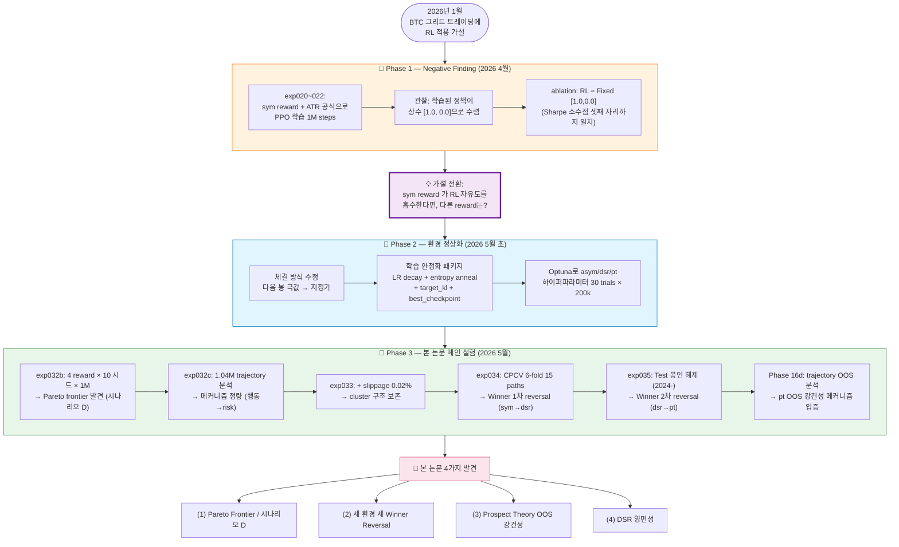
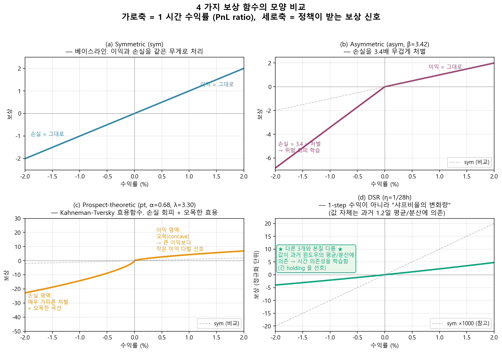
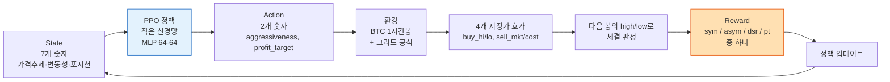
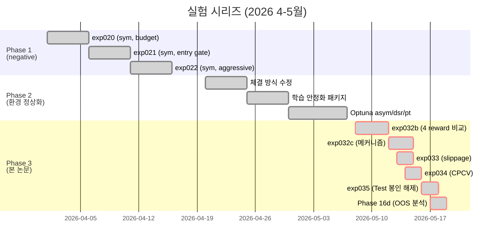
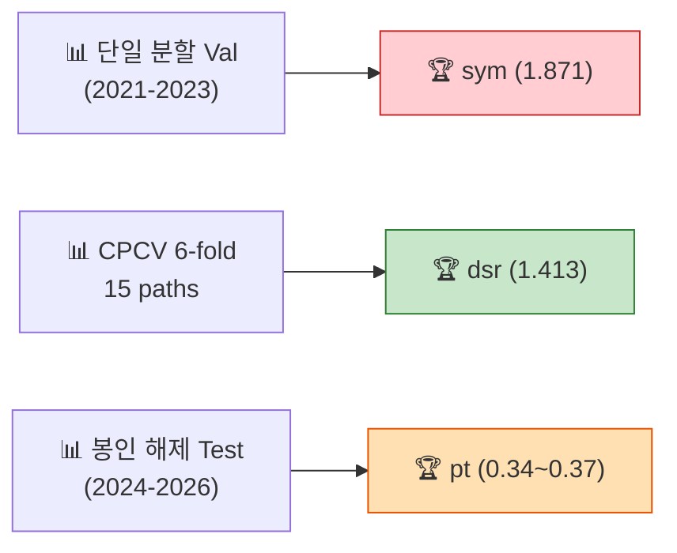
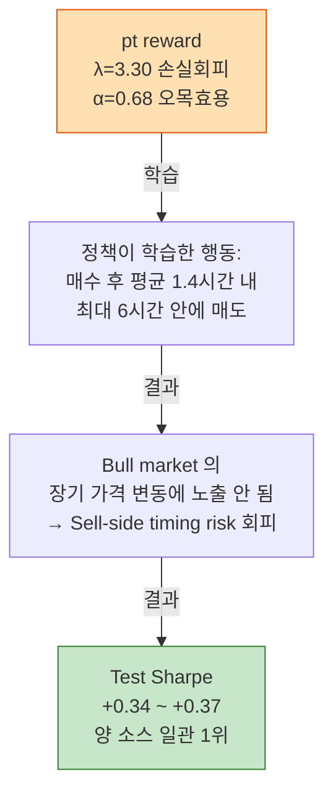

# 논문 읽기 가이드 — 비전문가용

> **이 문서가 무엇인가요?**
> 본 가이드는 [`main.pdf`](main.pdf) (영문) / [`main_ko.pdf`](main_ko.pdf) (한글) 캡스톤 논문을
> 강화학습이나 금융 트레이딩 배경이 없는 분도 이해할 수 있도록 풀어 쓴 부가 자료입니다.
> 논문의 형식적 abstract → introduction → method 순서가 아니라, **이야기 흐름**으로
> 재구성했습니다. 30분 정도 시간을 잡고 위에서 아래로 읽으면 논문 PDF를 펼쳤을 때
> 도식과 표가 무엇을 말하려는지 따라갈 수 있습니다.

**저자 / 소속**: 이찬희 (Lee Chanhee), 서울과학기술대학교 컴퓨터공학부
**제출 시점**: 2026년 6월
**코드 / 데이터**: <https://github.com/cosmicpotato2047/capstone-rl-trading>

---

## 목차

1. [30초 요약](#1-30초-요약)
2. [5분 요약](#2-5분-요약)
3. [배경 지식 — 전문지식 없이 따라오기](#3-배경-지식--전문지식-없이-따라오기)
4. [이 연구가 답하려는 질문](#4-이-연구가-답하려는-질문)
5. [연구 전체 흐름 한눈에 보기](#5-연구-전체-흐름-한눈에-보기)
6. [핵심 도구 ① — 4가지 보상 함수](#6-핵심-도구--4가지-보상-함수)
7. [핵심 도구 ② — 환경 설계 (MDP)](#7-핵심-도구--환경-설계-mdp)
8. [실험 단계별 흐름](#8-실험-단계별-흐름)
9. [4가지 핵심 발견](#9-4가지-핵심-발견)
10. [본 논문 그림 한 장씩 읽기](#10-본-논문-그림-한-장씩-읽기)
11. [인과 사슬 — 한 줄 정리](#11-인과-사슬--한-줄-정리)
12. [자주 묻는 질문 (FAQ)](#12-자주-묻는-질문-faq)
13. [한계와 다음 단계](#13-한계와-다음-단계)
14. [용어집](#14-용어집)
15. [더 자세히 읽고 싶다면](#15-더-자세히-읽고-싶다면)

---

## 1. 30초 요약

> 비트코인 시장에서 자동으로 매수·매도 주문을 깔아두는 **그리드 트레이딩** 전략을
> **강화학습(AI)** 으로 학습시킬 때, *AI에게 무엇을 "잘했다"고 알려주는 점수표(=보상 함수)*
> 의 모양이 정책의 성격을 결정한다.
>
> 4가지 보상 함수를 비교했더니, **단 하나의 최고 보상은 없었고**, 보상마다 다른 거래
> 성격(공격적 vs 보수적)으로 갈라졌으며, **평가 환경 3가지(과거 검증, 다중 시간 분할,
> 미공개 테스트)에서 우승자가 매번 바뀌는** 현상이 관측되었다.
>
> 특히 **인간의 손실 회피 심리(프로스펙트 이론)** 를 보상 함수로 직접 쓰면, AI가
> "짧게 잡고 빨리 빠지는" 행동을 배워서 **한 번도 본 적 없는 미래 시장(2024년 강세장)
> 에서도 안정적으로 수익을 낸다**는 것이 본 연구의 핵심 발견이다.

---

## 2. 5분 요약

### 무엇을 하는 시스템인가

비트코인(BTC) 1시간봉 가격을 입력받아, **현재 가격 위·아래로 몇 개의 매수/매도 주문**을
얼마나 떨어진 위치에 깔아둘지를 매 시간 결정하는 자동 매매 시스템입니다. 가격이 그
주문에 닿으면 자동 체결되어 작은 차익을 누적합니다. 이것이 "그리드 트레이딩"입니다.

```
가격 차트:        AI 가 매 시간 매수/매도 그리드 폭을 결정:

  ┃                    sell_mkt  ━━ (윗쪽 매도, 시장가 기반)
  ┃ ╱╲                 sell_cost ━━ (윗쪽 매도, 원가 회복 기반)
  ┃╱  ╲    ← 현재가
  ┃    ╲   buy_hi   ━━ (아래쪽 매수, 가까이)
  ┃     ╲╱ buy_lo   ━━ (아래쪽 매수, 멀리)
```

가격 방향 예측을 하지 않습니다. **변동성 자체에서 수익을 추구**합니다.

### 왜 강화학습인가

"그리드 폭을 얼마로 할지"는 시장 변동성에 따라 달라져야 합니다. 단순히 고정된
규칙(ATR 비례, 본 논문의 *baseline*) 으로 결정할 수도 있지만, **상태에 따라
동적으로 폭을 조정**하면 더 나은 성능이 가능할 거라는 가설로 강화학습(PPO)
정책에게 그리드 폭 결정을 맡깁니다.

### 왜 "보상 함수"가 핵심인가

강화학습은 "보상이 높은 행동을 더 많이 하자"라는 단순한 알고리즘입니다.
따라서 **보상이 무엇이냐**가 정책의 성격을 직접 결정합니다.
- 그냥 수익률을 보상으로 주면 → "위험하든 말든 일단 수익을 많이 내자"
- 손실에 더 큰 패널티를 주면 → "위험을 회피하자"
- 위험 조정 수익(샤프)을 보상으로 주면 → "수익은 적어도 변동성을 줄이자"
- 인간의 손실 회피 심리를 보상으로 주면 → "이익은 빨리 실현, 손실은 절대 피하자"

본 논문은 이 네 가지를 같은 환경에서 비교합니다.

### 핵심 발견 4가지

| # | 발견 | 한 줄 의미 |
|---|---|---|
| 1 | **시나리오 D — Pareto 프론티어** | 단일 우승자가 없다. 4 보상은 두 그룹(공격적 sym/dsr vs 보수적 asym/pt)으로 갈라지며 Sharpe-MDD 평면에서 trade-off frontier를 그린다. |
| 2 | **Winner Reversal** | 평가 환경(Val / CPCV / Test)에 따라 우승자가 매번 바뀐다. "X가 best"라는 단일 결론은 평가 방법에 종속적이다. |
| 3 | **Prospect Theory의 OOS 강건성** | 인간 손실 회피 심리(pt)를 reward로 쓰면 AI가 짧게 잡고 빠지는 정책을 학습 → 미공개 2024+ 강세장에서 양 소스 일관 1위. |
| 4 | **DSR의 양면성** | 같은 메커니즘(긴 holding)이 in-sample에서는 강점, OOS에서는 치명적 약점이 된다. |

### 학술적 기여 (왜 이 논문이 의미 있는가)

1. **Reward 변형 효과의 통계적 비교 프레임워크**: 4 reward × 10 시드 × 1M step,
   Cohen's d / 부트스트랩 / IQM / CVaR 등 신뢰성 확보.
2. **시나리오 D 발견**: 사전 등록한 시나리오 A/B/C 어디에도 들지 않는 새로운 결과 형태
   (Pareto frontier).
3. **Reward → 행동 → 결과의 인과 사슬 정량화**: trajectory 1.04M step 분석.
4. **Prospect theory가 RL trading 정책에 부여하는 OOS 안전성의 첫 정량 확인**
   (본 논문이 알기로는).

---

## 3. 배경 지식 — 전문지식 없이 따라오기

논문의 abstract만 봐도 "PPO", "ATR", "DSR", "CPCV" 등 약어가 잔뜩입니다. 이 절은
모든 약어를 풀이합니다. 이미 익숙하다면 건너뛰어도 좋습니다.

### 3.1 강화학습이 뭐예요?

> **한 줄 비유**: 강아지에게 "앉아"를 가르치는 방식의 컴퓨터 버전.

강화학습(Reinforcement Learning, RL)은:
1. 어떤 **환경**(environment)이 주어지고
2. **에이전트**(agent, 정책)가 매 순간 **행동**(action)을 하고
3. 환경이 **보상**(reward)을 돌려주고
4. 에이전트는 미래의 누적 보상을 최대화하도록 행동을 조금씩 바꿔갑니다.

본 논문에서:
- **환경** = BTC 1시간봉 시장 시뮬레이터
- **에이전트** = PPO라는 알고리즘으로 학습되는 정책 (작은 신경망)
- **행동** = 매 시간 "매수 호가는 얼마나 가까이? 매도 호가는 얼마나 멀리?"의 두 숫자
- **보상** = 1시간마다 자본 변화 (= 수익 또는 손실) — **여기를 4가지 모양으로 바꿔서 비교하는 것이 본 논문의 핵심**

**PPO** (Proximal Policy Optimization)는 강화학습 알고리즘 중 가장 표준적이고
안정적인 것 중 하나입니다. 본 논문에서는 PPO 자체를 바꾸지 않고 *보상 함수만* 바꿔서
어떤 정책이 학습되는지 비교합니다.

### 3.2 트레이딩이 뭐예요?

가격이 오르고 내리는 자산(주식, 코인 등)을 사고팔아 이익을 내는 행위입니다. 본 논문은
**비트코인(BTC)을 USDT(달러 페그 코인)로 사고파는 시장**을 다룹니다.

전통적인 트레이딩은 두 종류:
- **방향성 트레이딩**: "오를 것 같다 → 사두고 오르길 기다림". 가격 예측에 의존.
- **변동성 트레이딩**: 가격 방향과 무관하게 오르락내리락 하는 *흔들림* 자체에서 수익.
  본 논문이 다루는 그리드 트레이딩이 여기 속합니다.

### 3.3 그리드 트레이딩이 뭐예요?

> **한 줄 비유**: 낚시터에 여러 개의 낚싯대를 다른 깊이에 던져두는 것.

```
     현재가 100,000원

매도 호가 ─────  101,500원  ← sell_market (시장가에서 1.5% 위)
매도 호가 ─────  102,800원  ← sell_cost   (원가에서 2.8% 위)

   현재가  ▼

매수 호가 ─────   99,200원  ← buy_hi (현재가에서 0.8% 아래)
매수 호가 ─────   98,000원  ← buy_lo (현재가에서 2% 아래)
```

매 시간 위와 같이 **4개의 지정가 호가**를 깔아둡니다. 다음 1시간 동안 가격이
- 99,200원까지 떨어지면 → 매수 체결 (보유 시작)
- 98,000원까지 떨어지면 → 추가 매수 체결 (포지션 늘림)
- 101,500원까지 오르면 → 매도 체결 (이익 실현)

가격이 자주 오르락내리락 하면(=변동성이 클수록) 그리드가 자주 체결되어 작은 수익이
누적됩니다. **"방향"이 아니라 "흔들림"에서 돈을 버는 구조**입니다.

본 논문에서 강화학습의 역할은 **그리드 폭(얼마나 멀리 호가를 둘 것인가)을 동적으로
결정**하는 것입니다. 시장 상황(현재 변동성, 포지션 상태 등)을 보고 "지금은 좁게, 지금은
넓게" 학습합니다.

### 3.4 왜 BTC인가? 왜 1시간봉인가?

- **BTC**는 24시간 거래되는 거대 시장이라 데이터 품질이 좋고 (2017–현재), 변동성이
  높아 그리드 트레이딩에 유리합니다.
- **1시간봉**(=1시간마다 한 점)은 1분봉(노이즈 너무 많음)과 일봉(데이터 너무 적음)의
  적당한 중간입니다.
- 졸업 논문 범위에서 **단일 자산**으로 제한했습니다 (자산 확장은 future work).

### 3.5 ATR이 뭐예요?

**ATR (Average True Range, 평균 진실 범위)** = 최근 168시간 (= 1주일) 동안 가격이
얼마나 흔들렸는지를 나타내는 수치. 변동성을 측정하는 표준 지표입니다.

본 논문에서 ATR은 두 가지 역할:
1. **베이스라인 정책**의 그리드 폭을 자동으로 결정 (= "ATR 베이스라인")
2. **강화학습 정책**의 그리드 공식에도 사용됨: `격자폭 = ATR/가격 × (계수 + AI행동)`
   즉 RL은 "ATR이 정한 기본 폭에 추가로 얼마나 조정할까"를 학습합니다.

### 3.6 보상(reward)이 왜 중요한가요?

위에서 본 PPO 같은 알고리즘은 결국 **"보상이 높았던 행동을 더 자주, 보상이 낮았던
행동은 덜 자주"** 하도록 정책을 업데이트합니다. 즉:

> **보상 함수의 모양 = 정책의 가치관**

같은 시장, 같은 알고리즘이라도 보상 함수가 다르면 완전히 다른 정책이 학습됩니다.
**본 논문은 이 점을 정량적으로 보이는 것이 핵심 기여**입니다.

### 3.7 그 외 약어들

| 약어 | 풀이 | 한 줄 설명 |
|---|---|---|
| **MDP** | Markov Decision Process | 강화학습 문제의 수학적 정식화. state-action-reward의 무한 반복으로 환경을 표현. |
| **State** | 상태 | 매 시간 에이전트가 보는 정보 (가격 추세, 변동성, 보유 상태 등 7개 숫자). |
| **Action** | 행동 | 에이전트가 매 시간 출력하는 결정 (그리드 폭 2개 숫자). |
| **Sharpe ratio** | 샤프 비율 | 수익을 변동성으로 나눈 값. 높을수록 "위험 대비 수익"이 좋음. |
| **MDD** | Maximum Drawdown | 자산이 고점에서 최대로 떨어진 비율 (%). 낮을수록 안정적. |
| **Calmar** | Calmar 비율 | Return / MDD. 높을수록 "최대 손실 대비 수익"이 좋음. |
| **CPCV** | Combinatorial Purged Cross-Validation | 시계열 데이터를 시간 순으로 6등분하여 15가지 조합으로 평가하는 강건성 검증법. |
| **DSR (1)** | Differential Sharpe Ratio | 본 논문의 4 reward 중 하나. 샤프 비율의 미분 형태를 step reward로 사용. |
| **DSR (2)** | Deflated Sharpe Ratio | López de Prado(2014)의 백테스트 과적합 보정. (다른 개념이니 헷갈리지 말 것) |
| **OOS** | Out-Of-Sample | "학습/검증에 쓰이지 않은 데이터에서의 성능". 진정한 일반화 측정. |
| **B&H** | Buy-and-Hold | "그냥 사두고 가만히 있기" 전략. 모든 트레이딩 전략의 절대 비교 기준. |

---

## 4. 이 연구가 답하려는 질문

### 4.1 한 줄 RQ

> **BTC 그리드 트레이딩에서 reward 함수의 설계가 RL 정책의 행동 패턴과 일반화 성능에
> 어떤 영향을 미치는가? 특히, 어떤 reward 함수 하에서 RL이 ATR 규칙 기반을 초과하며
> (혹은 초과하지 못하며), 그 메커니즘은 무엇인가?**

### 4.2 왜 이 질문이 의미 있는가

기존 강화학습 트레이딩 연구의 대부분은:
- 알고리즘 비교 (PPO vs DQN vs A2C ...)
- 입력 데이터 변경 (가격만 vs 가격+지표 vs ...)
- state 설계 비교

에 집중되어 있고, **보상 함수 자체를 바꿔가며 통제 비교**한 연구는 드뭅니다.

본 논문이 다루는 4가지 보상은 강화학습/행동경제학의 **서로 다른 이론적 계보**에서
나옵니다:
- `sym` = 표준 PnL (기본형)
- `asym` = 위험 회피 효용의 1차 근사
- `dsr` = Moody(2001)의 differential Sharpe — 위험 조정 수익 직접 최적화
- `pt` = Kahneman & Tversky(1979)의 prospect theory — 행동경제학

같은 환경 위에서 이 네 가지의 효과를 분리 측정하는 것이 학술적 기여 포인트입니다.

### 4.3 4가지 가설 (H1~H4) + 사후 발견 (H5)

논문은 실험 전에 4가지 가설을 등록했습니다 (사후 합리화 방지). 그리고 실험 후
가장 중요한 발견을 H5로 새롭게 정의합니다.

| 가설 | 내용 | 결과 |
|---|---|---|
| **H1** | sym reward + ATR 비례 공식 조합에서 RL ≈ ATR | ❌ **부정** — sym RL이 ATR을 22~36% 초과 |
| **H2 weak** | asym/dsr/pt > ATR | ✅ **지지** — 4 변형 모두 ATR 초과 |
| **H2 strong** | asym/dsr/pt > sym | ⚠️ **부분 부정** — dsr은 sym과 동급, asym/pt는 더 낮음 (다른 차원에서 우위) |
| **H3** | 우수 reward의 효과는 "선택적 진입"으로 나타남 | ✅ **지지** — conservative cluster의 거래수가 sym 대비 25–35% 적음 |
| **H4** | 우위가 CPCV + Slippage에서도 유지 | ⚠️ **부분 지지** — cluster 구조는 robust, 절대 우위는 환경 의존 |
| **H5** (사후 발견 ★) | **Prospect theory reward가 OOS robust 정책을 산출** | ✅ **강한 지지** — 양 source 일관 p<0.002 |

---

## 5. 연구 전체 흐름 한눈에 보기

### 5.1 마스터 흐름도



### 5.2 무엇이 왜 그 순서인가

| 단계 | 의도 | 결과 |
|---|---|---|
| Phase 1 (이전) | "RL이 동적 변동성 적응을 학습한다" 가설 검증 | 정책 포화 → 가설 부정 |
| Phase 2 (이전) | Phase 1의 표면적 negative를 깊이 진단하고 환경 정상화 | 환경 + 학습 안정화로 출발선 마련 |
| **exp032b** | Reward 변형 비교 메인 실험 | 두 클러스터 발견 (시나리오 D) |
| **exp032c** | "왜" 두 클러스터인가 메커니즘 분석 | 행동 차이 정량 |
| **exp033** | 비용 모델 강건성 (sim2real) | cluster 구조 보존 |
| **exp034** | 평가 시기 강건성 (CPCV) | 1차 winner reversal |
| **exp035** | 진정한 OOS (test 봉인 해제) | 2차 winner reversal + H5 발견 |

---

## 6. 핵심 도구 ① — 4가지 보상 함수

### 6.1 직관적 설명

각 보상 함수는 **AI에게 "잘했다/못했다"를 알려주는 점수표**입니다. 모두 같은
입력(1시간 동안 자산이 얼마나 늘었나 = `x`)을 받아 점수를 출력합니다.

| 변형 | 한 줄 정의 | 직관적 의미 |
|---|---|---|
| **sym** | `r = x` | "수익이면 +, 손실이면 - 그대로". 가장 단순. |
| **asym** | 손실에 β배 패널티 | "이익은 그대로, 손실은 3.4배 무겁게 처벌하자" |
| **dsr** | 샤프비율의 미분 | "단순 수익이 아니라 위험 조정 수익을 보자. 과거 1.2일 평균/분산이 보상에 반영" |
| **pt** | Kahneman-Tversky 효용함수 | "사람처럼 손실을 두려워하고, 이익도 한계 효용이 체감되게 처리" |

### 6.2 함수 모양 비교 그림



**읽는 법**: 가로축은 1시간 동안의 수익률(%), 세로축은 정책이 받는 보상 신호.

- **(a) sym**: 가장 단순. 손실과 이익을 같은 무게. 회색 점선은 자기 자신이라
  생략됨.
- **(b) asym**: 손실 영역의 기울기가 sym보다 3.4배 가파르다. → "손실 회피 정책" 학습.
- **(c) pt**: 손실 영역이 매우 가파르고 + 곡선이 오목(concave). 큰 이익이 작은 이익보다
  추가로 1단위 받는 보상이 작다. → "큰 이익을 기다리는 것보다 작은 이익을 빨리
  실현"이 학습됨.
- **(d) dsr**: ★ 다른 3개와 본질적으로 다름. 단일 step 입력만으로 값이 결정되지
  않고, **과거 1.2일 간의 평균/분산이 보상 계산에 들어감**. 그래서 정책에
  *시간적 의존성*을 학습시킴 → 긴 holding 선호.

### 6.3 왜 dsr이 특별한가

다른 세 함수(sym, asym, pt)는 "1시간 PnL만 입력하면 보상이 나옴"입니다.
**dsr만 "1시간 PnL + 과거 윈도우의 평균/분산"이 입력**입니다. 이 *메모리 구조*가
정책에게 "긴 holding을 선호하라"를 학습시키는 직접적 원인입니다 (논문 §6.2).

```
sym(x), asym(x), pt(x)    → 입력: x 한 개
dsr(x | A_prev, B_prev)   → 입력: x + 과거 평균 A_prev + 과거 분산 B_prev
                                       ↑
                                 EWMA로 1.2일 윈도우 유지
```

이 차이가 본 논문 후반의 **DSR 양면성**(in-sample 우위 + OOS 실패)의 근원입니다.

### 6.4 하이퍼파라미터는 어떻게 정했나

각 변형의 하이퍼파라미터(β, η, α, λ)는 **Optuna로 30 trials × 200k steps** 자동 탐색해서
검증셋 Sharpe를 최대화하는 값을 골랐습니다:

| 변형 | 파라미터 | Optuna best | 인간 표준 (참고) |
|---|---|---|---|
| asym | β (손실 가중) | **3.420** | — |
| dsr  | η (EWMA decay) | **0.0352** (≈ 1/28h) | — |
| pt   | α (오목성) | **0.683** | 0.88 |
| pt   | λ (손실 회피) | **3.303** | 2.25 |

흥미롭게도 pt의 (α, λ)는 **인간 행동 표준값보다 더 극단적**입니다 (더 강한 손실 회피,
더 오목한 효용). 즉, BTC OOS 강건성을 위한 RL 정책의 최적 효용함수는 "인간보다 더
보수적"입니다 — 이는 본 논문의 부수 발견 중 하나로, "행동경제학 추정값을 그대로
RL에 쓰지 말고 도메인 데이터로 재튜닝하라"는 권고로 이어집니다.

---

## 7. 핵심 도구 ② — 환경 설계 (MDP)

### 7.1 한눈에 보기



### 7.2 State (7개 숫자) — 정책이 매 시간 보는 정보

| # | 이름 | 의미 |
|---|---|---|
| 0 | log_price | 현재가 / 168시간 평균. (1주 평균 대비 어디?) |
| 1 | divergence | 평단가 대비 괴리율 (보유 중일 때만 의미). |
| 2 | holdings_value_ratio | 자본의 몇 %를 BTC로 들고 있나. |
| 3 | cash_ratio | 자본의 몇 %가 현금인가. |
| 4 | volatility | ATR / 가격. (지금 시장이 얼마나 출렁이나) |
| 5 | trend_short | 3일 가격 변화율. |
| 6 | trend_long | 30일 가격 변화율. |

모두 168봉 rolling z-score로 정규화하여 [-5, 5]로 클리핑.

### 7.3 Action (2개 숫자) — 매 시간 정책이 결정하는 값

- `aggressiveness` ∈ [0, 1] → 매수 호가 2개의 위치 결정
- `profit_target`  ∈ [0, 1] → 매도 호가 2개의 위치 결정

이 두 숫자가 다음 공식에 들어가서 4개의 호가 가격이 결정됩니다:

```
buy_hi 가격     = 현재가 × (1 − ATR/현재가 × (A_b + B_b × aggressiveness))
buy_lo 가격     = 현재가 × (1 − ATR/현재가 × (C_b + D_b × aggressiveness))
sell_mkt 가격   = 현재가 × (1 + ATR/현재가 × (A_s + B_s × profit_target))
sell_cost 가격  = 평단가 × (1 + ATR/현재가 × (C_s + D_s × profit_target))
```

`(A_b, B_b, C_b, D_b, A_s, B_s, C_s, D_s)`는 환경 상수로 고정. Phase 2의 Optuna로
한 번 정해둔 값.

핵심: **ATR이 자동으로 변동성을 흡수**하고, 정책의 action은 그 위에서 "추가로 얼마나
좁게/넓게"를 결정합니다.

### 7.4 ATR 베이스라인 — 비교 대상

본 논문의 모든 RL 결과는 **"ATR 베이스라인"**(=강화학습 없이 같은 공식, action=[0,0] 고정)
과 비교됩니다.
- Val Sharpe: **1.378** (no slippage), **0.835** (with slippage 0.02%)
- Test Sharpe: **-0.055**

ATR 베이스라인은 단순 규칙이지만 변동성 자체에 적응하는 합리적 정책이므로, RL이
이를 초과해야 "강화학습의 의미"가 있다는 기준선입니다.

### 7.5 사이클 정의

- **사이클 시작**: 보유량 0 → 첫 매수 체결
- **사이클 종료**: 보유량이 다시 0으로 회복 (전량 매도)
- 사이클 시작 시 자본을 `n_splits=2`로 나누어 본 사이클에 절반 투입
- 그 절반을 다시 `n_buy_orders=2`로 나누어 매수 호가 2개에 분배

---

## 8. 실험 단계별 흐름

### 8.1 전체 실험 시리즈 도식



### 8.2 각 실험의 한 줄 의미

| 실험 | 무엇을 했나 | 왜 했나 | 결과 |
|---|---|---|---|
| **Phase 1 (exp020–022)** | sym reward로 PPO 1M step 학습 | "동적 변동성 적응" 가설 검증 | ❌ 정책 포화. RL = Fixed [1.0, 0.0] |
| **Phase 2** | 환경 정상화 + 학습 안정화 패키지 | Phase 1의 표면 negative를 깊이 진단 | ✅ 출발선 마련 |
| **exp032b** | 4 reward × 10 시드 × 1M step | 메인 비교 | Pareto frontier (시나리오 D) 발견 |
| **exp032c** | 1.04M step trajectory 행동 분석 | "왜 두 클러스터인가" | 거래 빈도·hold rate 차이 정량 |
| **exp033** | 슬리피지 0.02% 추가 후 재학습 | 비용 모델 강건성 | cluster 보존 (2.19×) |
| **exp034** | CPCV 6-fold 15 paths | 시기 강건성 | 1차 reversal: sym → dsr |
| **exp035** | Test 2024+ 봉인 해제 후 평가 | 진정한 OOS | 2차 reversal: dsr → pt |
| **Phase 16d** | Test trajectory 분석 | "왜 pt가 OOS robust?" | Hold duration 메커니즘 입증 |

### 8.3 데이터 분할

```
2017-08-17 ────── Train ────── 2020-12-31  (~30,000 봉, 학습 데이터)
2021-01-01 ─── Validation ──── 2023-12-31  (~26,000 봉, 모델 선택)
2024-01-01 ──── Test (봉인) ── 2026-04     (~20,000 봉, 마지막에만 1회 열람)
```

**Test는 exp035 (2026-05-16)까지 절대 열람 금지**였습니다. 모든 hyperparameter
결정, Optuna 탐색, 디버깅이 train+val 위에서만 일어났습니다. 본 논문 Test
결과는 **사상 첫 1회의 봉인 해제**입니다 (Gort et al. 2022 권장).

---

## 9. 4가지 핵심 발견

### 9.1 발견 1 — 시나리오 D (Pareto 프론티어)

**한 줄**: 4 reward 변형이 단일 winner가 아니라 **두 그룹**으로 갈라지며,
Sharpe-MDD 평면에서 trade-off frontier를 형성한다.

#### 사전에 등록한 시나리오

논문은 결과를 받기 전에 3가지 시나리오를 등록했습니다 (사후 합리화 방지):

| 시나리오 | 가정 | 결과 시 의미 |
|---|---|---|
| A (낙관) | asym/dsr/pt가 sym과 ATR 모두를 압도 | "Reward design이 RL alpha의 핵심 채널" |
| B (중립) | variant 간 차이는 있으나 ATR에 못 미침 | "ATR 공식이 강한 흡수력" |
| C (비관) | variant 간 차이 미미 | "Reward 형식 변경은 의미 없음" |

**실제 결과는 A/B/C 어디에도 들지 않았습니다**. → 사후 시나리오 D를 정의:

> **시나리오 D**: 4 변형 모두 ATR을 초과하지만 단일 winner는 없으며,
> Sharpe-MDD 평면에서 **두 클러스터의 Pareto-유사 frontier**를 형성한다.

#### 시각화


**읽는 법**:
- 점 하나 = 한 시드의 학습 결과 (40개 = 4 variant × 10 시드)
- 가로축: best Val Sharpe (오른쪽일수록 좋음)
- 세로축: MDD (아래일수록 좋음)
- 색: variant 구분

**관찰**:
- 🔴 sym (빨강) + 🟢 dsr (녹색) → **오른쪽 위**: 높은 Sharpe + 높은 MDD (공격적)
- 🔵 asym (파랑) + 🟠 pt (주황) → **왼쪽 아래**: 중간 Sharpe + 낮은 MDD (보수적)
- ATR 베이스라인은 (1.378, 9.83) — 모든 RL 점에 의해 Pareto-dominate됨

#### 통계적 분리

같은 클러스터 안에서는 차이가 작고, 클러스터 사이에는 차이가 큽니다.

| 비교 | Cohen's d (Sharpe) | 정책 거리 (L2) |
|---|---|---|
| within: sym vs dsr | 0.29 (작음) | 0.123 |
| within: asym vs pt | 0.15 (작음) | 0.134 |
| across: sym vs asym | 1.10 (큼) | 0.209 |
| across: sym vs pt | 1.19 (큼) | 0.326 |
| across: dsr vs asym | 0.79 (큼) | 0.256 |
| across: dsr vs pt | 0.89 (큼) | 0.353 |
| **across/within 비율** | — | **2.22×** |

즉, **같은 클러스터의 정책들이 다른 클러스터보다 2.22배 더 행동이 비슷**합니다.
Sharpe 수준의 클러스터가 정책 행동 수준의 클러스터로 일관 확인됩니다.

### 9.2 발견 2 — Winner Reversal (세 환경 세 우승자)

**한 줄**: 평가 환경이 바뀌면 우승자도 매번 바뀐다.



#### 무엇을 의미하나

- **단일 분할 Val**: 특정 2021-2023 시기에 가장 잘 맞는 정책 → sym
- **CPCV multi-split**: 다양한 시기에 걸쳐 *일관되게* 좋은 정책 → dsr
- **Test OOS**: 학습 시 본 적 없는 미래 분포에서 *살아남는* 정책 → pt

**같은 reward가 어디서는 1위, 어디서는 꼴찌**가 됩니다. "X가 best"라는 단일 결론은
*평가 방법의 선택*에 종속됩니다.

#### 논문의 권고

본 논문은 RL 트레이딩 연구의 표준 평가 프로토콜로 **세 환경 동시 사용**을 권고합니다:

1. Single-split Val → 일반적 정책 행동 + baseline 우열
2. CPCV multi-split → 시기 강건성
3. Sealed Test → 진정한 OOS 안전성 (실 운용 우선순위)

### 9.3 발견 3 — Prospect Theory의 OOS 강건성 (H5, 본 논문 핵심)

**한 줄**: 인간의 손실 회피 심리를 reward로 쓰면 AI가 "짧게 잡고 빠지는" 정책을 학습해서
미공개 강세장에서도 안정적이다.

#### Test (2024+) 결과

| 변형 | exp032b source<br/>(n=10) | exp034 source<br/>(n=15) | p-value (양 소스) |
|---|---|---|---|
| sym  | +0.090 ± 0.11 | +0.001 ± 0.19 | 0.015 / 0.495 |
| asym | +0.173 ± 0.20 | +0.175 ± 0.25 | 0.011 / 0.009 |
| dsr  | **-0.122** ± 0.19 | +0.070 ± 0.25 | 0.961 / 0.150 |
| **pt** | **+0.367** ± 0.29 ★ | **+0.339** ± 0.31 ★ | **0.0015 / 0.0004** ★ |

ATR baseline Test Sharpe = -0.055.

#### 왜 pt가 살아남는가? — 메커니즘



대조적으로:

```mermaid
flowchart TD
    DSR[dsr reward<br/>EWMA 1.2일 윈도우<br/>= 시간 의존성 부여] -->|학습| Behavior[정책이 학습한 행동:<br/>매수 후 평균 4.6시간<br/>최대 7일까지 holding]
    Behavior -->|in-sample| CPCV[CPCV: 다양한 시기에<br/>일관 성능 → 1위 1.413]
    Behavior -->|OOS bull market| Risk[BTC 42K→75K 강세장에서<br/>긴 hold = sell 호가가<br/>시장에서 멀어짐]
    Risk -->|결과| Fail[Test Sharpe<br/>-0.12 (exp032b source)<br/>4위, ATR보다도 나쁨]
    
    style DSR fill:#E0F2F1,stroke:#00695C
    style CPCV fill:#C8E6C9,stroke:#2E7D32
    style Fail fill:#FFCDD2,stroke:#C62828
```

**핵심 통찰**: 같은 메커니즘("긴 holding 학습")이 평가 환경에 따라 강점/약점 부호가
반대로 작동합니다.

#### Hold duration 분포 (Phase 16d)

| 변형 | sessions | mean (h) | median (h) | p95 (h) | **max (h)** |
|---|---|---|---|---|---|
| sym  | 5,666 | 2.15 | 1.0 | 5 | 98 |
| asym | 4,567 | 1.40 | 1.0 | 3 | 7 |
| dsr  | 5,384 | **4.58** | 1.0 | **20** | **169 (7일!)** |
| pt   | 3,922 | **1.39** | 1.0 | 3 | **6** |

→ pt는 가장 짧고 max도 6시간으로 short-bounded. dsr만 7일까지 늘어남.

### 9.4 발견 4 — DSR의 양면성

위에서 이미 다뤘지만, 별도로 강조할 가치가 있어서 별도 항목으로 정리.

> **같은 reward formulation 의 같은 행동 효과 (긴 holding) 가**
> **평가 환경에 따라 반대 부호로 작동한다.**

| 평가 환경 | DSR 결과 | 이유 |
|---|---|---|
| 단일 분할 Val | 1.809 (2위) | 긴 hold가 학습 후반 안정성↑ |
| CPCV multi-split | **1.413 (1위)** ★ | 긴 hold = 시기 의존성↓, robust |
| Test 봉인 해제 | **-0.122 (꼴찌)** ★ | 긴 hold = bull market에서 sell timing risk 폭증 |

이 발견은 *"in-sample 우위와 OOS 강건성은 reward formulation 선택의 trade-off"*
라는 본 논문 frame을 직접 입증합니다.

#### Val ↔ Test generalization gap

| 변형 | exp032b Val→Test | exp034 CPCV→Test |
|---|---|---|
| sym  | -1.78 | -1.30 |
| asym | -1.51 | -0.87 |
| dsr  | **-1.93 (worst)** | -1.34 |
| **pt** | **-1.30 (smallest)** | **-0.75 (smallest)** |

모든 정책에 gap이 있지만 pt가 가장 작고, dsr이 가장 큽니다.

### 9.5 보너스 — 시장 분포 이동이 진짜 원인

"Val→Test gap이 정책이 변한 탓인가, 시장이 변한 탓인가?"를 정직하게 확인했습니다.

| 측정 | 결과 |
|---|---|
| 같은 모델의 Val/Test 행동 차이 (4 variant 평균) | **Δ ≤ 5%** (거의 동일) |
| Val/Test 변동성 (ATR/price 평균) | 0.96% → 0.70% (**-27%**) |
| KS test p-value | **< 10⁻¹⁰** (통계적으로 매우 유의) |

→ **정책은 robust하게 같은 행동을 출력**하지만, 그 행동이 다른 시장에서 다른 결과를 낳습니다.
OOS 성능 차이의 원인은 **정책의 변화가 아니라 시장의 distribution shift**입니다.

---

## 10. 본 논문 그림 한 장씩 읽기

논문 PDF를 펼쳐서 도식이 나올 때 이 절을 옆에 두고 보면 됩니다.

### 10.1 exp032b — 4 reward 메인 비교

#### Fig: Boxplot of Sharpe (4 variants)


- 박스의 가운데 선 = 중앙값
- 박스 위/아래 = IQR (25–75 분위)
- 같은 클러스터끼리 박스 위치가 비슷, 다른 클러스터끼리 분리됨

#### Fig: Cohen's d Heatmap


- 셀의 색이 진할수록 페어 차이가 큼
- **대각선 블록** (sym-dsr 위쪽 / asym-pt 아래쪽) 이 옅고, **오프-대각선** (sym/dsr vs
  asym/pt) 이 진함 → 두 클러스터 시각적 확인

### 10.2 exp032c — 메커니즘 분석

#### Fig: Pareto scatter (가장 중요한 한 장)


- 40개 점 (4 variant × 10 시드)
- 두 색 그룹이 평면의 다른 영역에 모임
- ATR 베이스라인 (별표) 위치는 왼쪽 위 (Sharpe 낮음 + MDD 큼)

#### Fig: Action distribution (3 regime × 4 variant)


- 12개 패널의 그리드
- 각 패널은 (variant, vol regime) 조합의 2D action 분포
- 빨간 십자가 = 평균
- sym/dsr 패널: 평균이 (0.12, 0.06) 근처 (좁은 매수, 빠른 매도)
- asym/pt 패널: 평균이 (0.3–0.45, 0.05) 근처 (멀리 매수, 빠른 매도)
- **dsr만 매도 쪽 (a^(1))이 0.15로 더 큼** → 긴 hold의 직접 원인

#### Fig: Behavior per regime (trade/hold rate)


- 위 행: trade rate, 아래 행: hold rate
- **DSR의 hold rate 막대가 다른 3개의 2-6배** → 시각적으로 한눈에 띔

#### Fig: Policy distance matrix


- 4×4 행렬, 셀의 색이 진할수록 두 정책의 행동이 유사
- 대각선 블록 (sym-dsr, asym-pt) 이 진함 → 클러스터 행동 수준 확인

### 10.3 exp033 — Slippage 강건성


- 연한 색: slippage 없음 (exp032b)
- 진한 색: slippage 0.02% (exp033)
- 4 variant 모두 ~12% 감쇠하지만 **순서 + cluster 구조는 보존**

### 10.4 exp034 — CPCV 다중 분할

#### Fig: CPCV Sharpe Boxplot


- 15 path × 4 variant
- **dsr의 박스가 가장 좁고 가장 높음** → CPCV 1위로의 reversal

#### Fig: CPCV Heatmap (variant × path)


- 4 행 × 15 열, 각 셀의 색 = 해당 (variant, path)의 Sharpe
- dsr 행이 일관되게 어두운 색 (높은 Sharpe), asym/pt 행은 path 간 편차 큼

### 10.5 exp035 — Test 봉인 해제

#### Fig: Test Sharpe Boxplot


- 두 source (exp032b 학습 모델 vs exp034 학습 모델) × 4 variant = 8 박스
- **pt 박스가 두 source 모두 가장 높이** 위치
- dsr 박스가 exp032b source에서 음수 영역으로 떨어짐
- ATR baseline (점선) = -0.055

#### Fig: Val vs Test 비교


- 가로축 Val Sharpe, 세로축 Test Sharpe
- 대각선 (Val = Test) 위에 있는 점이 하나도 없음 → 모두 OOS gap 존재
- **pt 점이 가장 위쪽** (Val에서는 낮은 위치였지만 Test에서는 가장 높음)

### 10.6 Phase 15 — 분포 이동 분석

#### Fig: Val vs Test 시장 분포


- 파란 분포 (Val 2021-2023): 폭 넓음 (변동성 높음)
- 주황 분포 (Test 2024-2026): 폭 좁음 (변동성 -27%) + 평균이 양수 방향 이동
- KS p < 10⁻¹⁰ → 통계적으로 다른 분포

#### Fig: 세 환경 winner 비교


- Val / CPCV / Test 세 환경의 4 variant Sharpe 비교
- 환경마다 다른 variant가 가장 높음 → winner reversal 한 장 요약

### 10.7 Phase 16d — Test 행동 분석

#### Fig: Hold duration 분포


- 4 variant의 hold duration histogram
- dsr이 long-tail (오른쪽으로 길게) → max 169시간 (7일!)
- pt의 분포는 가장 좁고 빨리 끝남 (max 6시간)

#### Fig: Val/Test 정책 행동 안정성


- 같은 모델의 Val/Test 행동 비교
- 모든 variant에서 Δ ≤ 5% → 정책은 변하지 않았음
- → OOS gap은 정책이 아닌 시장 분포 이동이 원인

---

## 11. 인과 사슬 — 한 줄 정리

본 논문 전체의 메커니즘을 한 줄로:

```
┌─────────────────────────────────────────────────────────────────┐
│                                                                 │
│  Reward 형식  →  거래 빈도 + Hold 시간  →  Risk profile         │
│                                              cluster            │
│                                          →  (Sharpe, MDD)       │
│                                              trade-off          │
│                                          →  환경별 winner       │
│                                              reversal           │
│                                                                 │
└─────────────────────────────────────────────────────────────────┘
```

화살표별 정량 증거:

| 화살표 | 정량 증거 |
|---|---|
| Reward 형식 → 거래 빈도 | asym(β=3.42), pt(λ=3.30)이 매수 호가를 멀리 배치 → 거래 빈도 25-35% 감소 |
| Reward 형식 → Hold 시간 | DSR의 sliding-window memory가 긴 hold의 SNR↑ → hold rate 2-6배 |
| 거래 빈도 + Hold → Risk profile | 적게 거래 + 짧은 hold = MDD↓ + Calmar↑ (conservative) |
| Risk profile → 환경별 winner | aggressive: in-sample 우위 / conservative + 짧은 hold: OOS 강건 |

---

## 12. 자주 묻는 질문 (FAQ)

### Q1. 그래서 이 시스템으로 돈을 벌 수 있어요?
**A**: 단기 답: **현재 형태로는 권하지 않음**. 본 논문은 학술 연구로, 다음 한계가 있습니다:
- 단일 자산 (BTC), 단일 시간단위 (1시간봉) 만 검증
- Test 시기 (2024+) 의 BTC는 강한 상승장 → buy-and-hold가 단순 수익률은 더 높음
  (B&H Sharpe 0.757 > pt 0.367). 단, B&H MDD 50% vs pt MDD 2.3% → risk-adjusted (Calmar)로는 pt 약 10배 우위
- 실제 거래 슬리피지/수수료는 본 논문보다 더 큰 영향을 줄 수 있음
- 본 논문의 메인 contribution은 **"어떤 reward가 OOS 강건한가의 메커니즘 정량"** 이지
  실 거래 시스템 권고가 아님

### Q2. 4 reward 중 어느 것이 진짜 best인가요?
**A**: **단일 답이 없습니다.** 평가 방법에 따라:
- 단일 시기 최대 Sharpe → sym
- 다양한 시기 일관 안정 → dsr
- 미공개 미래에서 살아남기 → **pt** ← 본 논문이 가장 중요시
- MDD 최소화 → asym (pt와 거의 동등)

### Q3. 왜 dsr이 CPCV에서는 1위, Test에서는 꼴찌인가요?
**A**: 같은 메커니즘 (긴 holding) 이:
- **CPCV**: 다양한 시기에 걸쳐 robust한 정책으로 작동 → 강점
- **Test (강세장)**: 긴 hold 동안 가격이 멀리 가버려 sell 호가가 못 미치는 timing risk → 약점

같은 정책이 시장 분포가 다르면 정반대 결과를 낳을 수 있다는 정직한 발견입니다.

### Q4. ATR 베이스라인을 왜 그렇게 강조하나요?
**A**: 강화학습이 단순 규칙(ATR)을 못 이긴다면 "강화학습의 의미"가 없습니다. 따라서
**RL이 ATR을 통계적으로 초과한다**는 사실이 반드시 입증되어야 합니다. 본 논문은
모든 4 variant가 ATR을 22-36% 초과 (Bonferroni 보정 후 p<0.004) 함을 보입니다.

### Q5. Test를 왜 그렇게까지 봉인했나요?
**A**: 백테스트 과적합 (= 미공개 시기로 알았던 데이터를 사실은 미리 본 셈)을 방지하기
위해서입니다. Test를 한 번 보면 결과를 보고 "어 이게 안 되네, 살짝 hyperparameter
바꿔볼까" 하는 유혹이 생깁니다. 그 순간 Test는 더 이상 "미공개 미래"가 아니라
"새로운 validation"이 됩니다. Gort et al.(2022)의 권고에 따라 exp035 단계까지 **어떤
분석에도 Test partition을 사용하지 않았습니다**.

### Q6. 1M step 학습이 얼마나 걸리나요?
**A**: 시드당 약 4시간 (Windows 11 CPU, n_envs=4 병렬). 본 논문 전체 (Phase 3) 학습량:
- exp032b: 4 × 10 × 1M = 40M step (~3h 44m)
- exp033: 같은 양 (~3h 47m)
- exp034: 4 × 15 × 1M = 60M step (~5h 27m)
- 총 ~17시간 + Optuna 탐색 ~2시간

### Q7. 왜 인간 표준 (α=0.88, λ=2.25) 가 아닌 Optuna best (α=0.683, λ=3.303) 인가요?
**A**: 사람이 실제 의사결정에서 보이는 행동에 fit된 값이 사람의 표준값입니다. 그러나
**RL 정책에 가장 좋은 효용함수의 모양**은 다를 수 있습니다. 본 논문은 Optuna로 검증
Sharpe를 최대화하는 (α, λ) 를 찾았고, 결과적으로 인간보다 **더 강한 손실 회피 + 더
오목한 효용**이 RL 정책에 유리함을 발견했습니다. 이는 "행동경제학 추정값을
그대로 RL에 쓰지 말고 도메인 데이터로 재튜닝하라"는 실용적 권고로 이어집니다.

### Q8. 4 reward만 비교했나요? 더 많이 시도하지 그랬어요?
**A**: 졸업 논문 범위 (자원/시간) 제약입니다. 4 reward는:
- sym (베이스라인, 표준)
- asym (위험 회피 효용의 1차 근사)
- dsr (Moody 2001, 위험 조정 수익 명시)
- pt (Kahneman 1979, 행동경제학 기초)

으로 4가지 이론적 계보를 대표합니다. 더 많은 변형 (예: Conditional VaR reward,
hyperbolic discounting, ...) 은 future work로 남겨두었습니다.

---

## 13. 한계와 다음 단계

### 13.1 정직하게 인정한 한계

| # | 한계 | 영향 |
|---|---|---|
| 1 | **자산 범위 = BTC 단일** | "pt OOS robust"의 일반화 검증 안 됨 |
| 2 | **Test regime = 강세장 단일** | bear/sideways에서도 같은 결과일지 미확인 |
| 3 | **Slippage = 단일 수준 0.02%** | 다단계 sensitivity 안 함 |
| 4 | **Domain Randomization 미적용** | DR로 dsr OOS 실패가 회복 가능할지 미확인 |
| 5 | **학습 길이 = 1M step 단일** | 더 긴 학습이 결과를 바꿀 가능성 |

### 13.2 정직하게 인정한 추가 사실

- **exp027_rl 사전 증거의 환경 의존성**: Phase 2 후기 (Env-v3) 에서 asym이 Test
  Sharpe 1.955로 매우 강했으나, 본 논문 canonical Env-v4 에서 재실행하니 sym (1.871) 보다
  낮음. **환경 변경 효과 > reward variant 효과**라는 사실을 §8.2에서 정직 인정.
- **B&H baseline의 강세장 우위**: 2024+ BTC가 +78% 상승하는 환경에서 buy-and-hold
  Sharpe 0.757은 모든 RL을 초과. 단, MDD 50% vs pt MDD 2.3% → risk-adjusted (Calmar)
  로는 pt 약 10배 우위. **본 논문의 "pt OOS robust" 주장은 risk-adjusted return의
  의미에서 성립하며 absolute return의 의미가 아님**.

### 13.3 Defense 우선순위가 높은 future work 3개

1. **Multi-asset 검증** — pt OOS robust를 주식 ETF, FX 등에서 검증. 짧은-hold
   메커니즘의 일반화 정량.
2. **Meta-RL adaptive reward parameter** — (α, λ) 를 시변으로 online 적응하는
   meta-RL 시도.
3. **Domain Randomization 통합** — DR로 dsr의 OOS 실패가 회복되는지 (같은 reward의
   양면성이 DR로 해소 가능한지) 정량.

---

## 14. 용어집

| 용어 | 뜻 |
|---|---|
| **Action** | 정책이 매 시간 출력하는 행동 (본 논문에서는 2개 숫자) |
| **Asymmetric reward** | 손실에 양의 가중치 β를 부여하는 변형 |
| **ATR** | Average True Range. 168시간 윈도우의 평균 진실 범위 (변동성 지표) |
| **Backtest overfitting** | 백테스트를 과도하게 조정하여 OOS에서 실패하는 현상 |
| **Best checkpoint** | 학습 중 Val Sharpe가 가장 높았던 시점의 모델 가중치 |
| **Bull market** | 상승장. 본 논문 Test (2024+) 가 이에 해당 |
| **Calmar ratio** | Annualized Return / MDD. risk-adjusted return의 한 형태 |
| **Cluster** | 본 논문에서는 {sym, dsr} = aggressive 와 {asym, pt} = conservative 두 그룹 |
| **Cohen's d** | 두 분포의 평균 차이를 표준편차로 정규화한 효과 크기 척도. |d|<0.3 작음, |d|>0.8 큼 |
| **CPCV** | Combinatorial Purged Cross-Validation. 시계열 누설을 차단한 다중 분할 |
| **Cycle** | 보유 0 → 첫 매수 → 다시 보유 0까지의 한 거래 단위 |
| **Deflated Sharpe Ratio (DSR*)** | López de Prado(2014). 백테스트 시도 횟수 보정 |
| **Differential Sharpe Ratio (DSR)** | Moody(2001). 본 논문의 4 reward 중 하나 |
| **Distribution shift** | 학습 시기와 평가 시기의 시장 분포가 다른 현상 |
| **Domain Randomization (DR)** | 학습 시 환경 파라미터 (슬리피지, fee 등) 를 randomize하여 OOS robust 정책 학습 |
| **Episode** | 강화학습의 한 에피소드. 본 논문은 720시간 (30일) 으로 설정 |
| **EWMA** | Exponentially Weighted Moving Average. 최근 데이터에 더 큰 가중치 |
| **Gymnasium** | OpenAI Gym의 후속 표준 강화학습 환경 인터페이스 |
| **Hold rate** | (보유 중 + 체결 없음) 스텝 / 전체 스텝 |
| **Hyperparameter** | 학습 전에 정해두는 값 (lr, β, η, α, λ 등) |
| **IQM** | Interquartile Mean. 25-75 분위 평균. 이상치 robust |
| **MDD** | Maximum Drawdown. 자산이 고점에서 최대 떨어진 비율 |
| **MDP** | Markov Decision Process. 강화학습 문제의 정식화 |
| **OOS** | Out-Of-Sample. 학습/검증에 쓰이지 않은 데이터에서의 성능 |
| **Optuna** | 하이퍼파라미터 자동 탐색 라이브러리. TPE sampler 사용 |
| **Pareto frontier** | 한 metric을 개선하면 다른 metric이 악화되는 trade-off 곡선 |
| **PnL** | Profit and Loss. 손익 |
| **Policy** | 강화학습의 의사결정 함수. 본 논문에선 MLP [64, 64] |
| **PPO** | Proximal Policy Optimization. 본 논문 사용 알고리즘 |
| **Prospect Theory** | Kahneman & Tversky(1979). 인간의 위험 회피 행동을 설명하는 효용 모형 |
| **Purge** | CPCV에서 train/test 경계의 ±168h를 제외하여 정보 누설 방지 |
| **Quote / 호가** | 매수/매도 의향 가격 |
| **Random seed** | 학습의 무작위성을 결정하는 정수. 본 논문 10시드 (42-51) |
| **Reward** | 강화학습의 보상 신호. 본 논문에서 4가지 변형 비교 |
| **Sharpe ratio** | 평균 수익률 / 수익률 표준편차. risk-adjusted return |
| **Slippage** | 호가와 실제 체결가의 차이 (시장 마찰) |
| **stable-baselines3** | PyTorch 기반 강화학습 라이브러리 표준 |
| **State** | 정책이 매 시간 보는 관측. 본 논문 7차원 |
| **Symmetric reward** | 이익과 손실을 같은 무게로 처리하는 베이스라인 reward |
| **Test partition** | 봉인된 OOS 데이터. 본 논문 2024-01 ~ 2026-04 |
| **Trade rate** | 체결 발생 스텝 / 전체 스텝 |
| **Trajectory** | (state, action, reward, ...) 의 한 에피소드 sequence |
| **Validation** | 모델 선택에 사용하는 데이터. 본 논문 2021-2023 |
| **Win reversal** | 평가 환경이 바뀔 때 1위 variant가 바뀌는 현상. 본 논문 핵심 frame |

---

## 15. 더 자세히 읽고 싶다면

### 15.1 본 논문 직접 읽기

- 한글: [`main_ko.pdf`](main_ko.pdf)
- 영문: [`main.pdf`](main.pdf)
- 추천 순서 (비전문가): Abstract → §1 Introduction → §4 Phase 1 negative finding →
  §5 Pareto frontier → §6 메커니즘 → §7.3 OOS → §9 Conclusion

### 15.2 프로젝트 부속 문서

| 문서 | 내용 |
|---|---|
| [`docs/PROJECT_GOAL.md`](../../docs/PROJECT_GOAL.md) | 본 논문 단일 기준점 (RQ + 가설 + scope) |
| [`docs/MDP.md`](../../docs/MDP.md) | State/Action/Reward 설계 근거 |
| [`docs/FORMULAS.md`](../../docs/FORMULAS.md) | ATR 고정 / RL 버전 공식 |
| [`docs/RELATED_WORK.md`](../../docs/RELATED_WORK.md) | 7편 선행 연구의 역할 및 차별점 |
| [`docs/RESULTS_SUMMARY.md`](../../docs/RESULTS_SUMMARY.md) | Phase별 결과 요약 |
| [`RESEARCH_LOG.md`](../../RESEARCH_LOG.md) | 날짜별 실험 의사결정 기록 |
| [`ROADMAP.md`](../../ROADMAP.md) | Phase별 진행 현황 |

### 15.3 학습 자료 (이 분야를 더 공부하고 싶다면)

| 문서 | 분야 |
|---|---|
| [`docs/study/rl_finance/00_overview.md`](../../docs/study/rl_finance/00_overview.md) | RL × Finance 24개 노트 인덱스 |
| Wilder (1978) | ATR 원본 |
| Schulman et al. (2017) | PPO 원본 논문 |
| Moody (2001) | DSR 원본 |
| Kahneman & Tversky (1979) | Prospect Theory 원본 |
| López de Prado (2018) ch.8 | CPCV 원본 |
| Gort et al. (2022) | Crypto DRL backtest overfitting (본 논문 평가 프로토콜 근거) |
| Henderson et al. (2018) | RL reproducibility (시드 통계 권장사항) |

### 15.4 코드 / 데이터 접근

GitHub: <https://github.com/cosmicpotato2047/capstone-rl-trading>

주요 디렉토리:
- `src/` — 환경, 정책, 학습 로직
- `scripts/` — 실험 실행 진입점
- `config/experiment_config.yaml` — 모든 수치 파라미터
- `data/processed/` — 전처리된 BTC 1시간봉 (train / val / test — test는 봉인)
- `reports/expXXX/` — 실험별 결과 figure + csv

---

**문서 끝.** 읽어주셔서 감사합니다. 본 논문이나 가이드 내용에 질문이 있으시면 
GitHub Issues 또는 저자 이메일(`happilyfly@seoultech.ac.kr`)로 연락 주세요.
