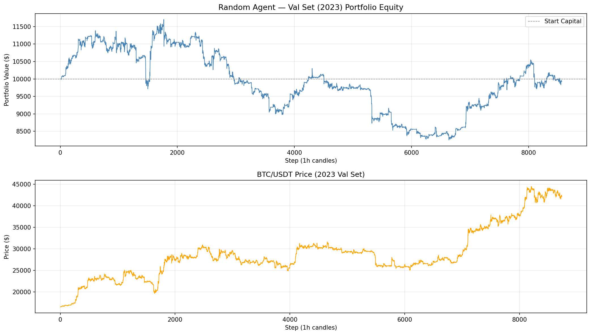

# 📝 주간 보고서 — Week 5 (2026-04-03 ~ 2026-04-09)

> **이번 주 목표 한 줄 요약:**
> 데이터 파이프라인을 완성하고, 그리드 트레이딩 강화학습 환경(`BTCGridTradingEnv`)의 핵심 로직을 구현하여 SB3 PPO 학습 준비 상태를 확보한다.

---

## 1. 전주 목표 달성 확인

| 목표 | 결과 | 비고 |
|------|------|------|
| MDP 설계 확정 및 제안서 v3.0 제출 | ✅ | 이산→연속 행동 공간으로 전면 재설계 |
| 프로젝트 폴더 구조 및 스캐폴딩 완성 | ✅ | `src/`, `scripts/`, `config/`, `notebooks/` 등 |
| `experiment_config.yaml` 파라미터 확정 | ✅ | 전체 하이퍼파라미터 단일 파일 관리 |
| ccxt Binance 데이터 다운로드 | ✅ | 54,933개 캔들, 2020-01-01 ~ 2026-04-09 |
| 전처리 파이프라인 구현 | ✅ | ATR, log_price, rolling z-score |

---

## 2. 진행 내용

### 완료 항목

- **`scripts/download_data.py`** — ccxt Binance API로 BTC/USDT 1h봉 다운로드
  - 1,000캔들 단위 페이지네이션으로 전체 기간 수집
  - 출력: `data/raw/btc_usdt_1h.csv` (54,933행)

- **`scripts/preprocess_data.py`** — 지표 계산 + 분할 + Parquet 저장
  - ATR(168) 직접 구현 (True Range rolling mean, pandas-ta 미사용)
  - log_price = log(close / close.rolling(168).mean())
  - rolling z-score(window=168) 정규화
  - Train / Val / Test 분할 후 `data/processed/` 저장

- **`src/env/trading_env.py`** — 5개 핵심 메서드 구현
  - `_get_observation()`: 5D state 벡터, clip [-5, 5]
  - `_execute_buy()`: 가중평균 avg_price, 사이클 시작 감지
  - `_execute_sell()`: 전량 청산 시 `_close_cycle()` 자동 호출
  - `_close_cycle()`: cycle_pnl_pct + alpha/cycle_hours 보너스
  - `_process_fills()`: **Sell 우선 원칙** — sell_lo → sell_hi → buy_hi → buy_lo 순 처리

- **`pyproject.toml`** 생성 — `ModuleNotFoundError: No module named 'src'` 해결

- **`gymnasium.utils.env_checker` 통과** 확인

### 사용 데이터 / 실험 환경

- **데이터:** btc_val.parquet (2023-01-01 ~ 2023-12-31, 8,736행)
- **초기 자본:** $10,000 / **수수료:** 0.05% (Binance maker fee)
- **실험 조건:** 랜덤 에이전트, seed=42, 1 에피소드
- **하이퍼파라미터 변경:** 없음 (초기값 유지)

---

## 3. 결과

### A. 예상대로 진행됨

- `env_checker` 통과 — action_space, observation_space 모두 SB3 호환 확인
- 데이터 파이프라인 (다운로드 → 전처리 → 분할) 정상 작동
- Sell 우선 원칙 구현 후 같은 봉에서 buy + sell 동시 체결 로직 정상 처리

### B. 예상과 다르게 진행됨

- **pandas-ta 설치 실패** — Python 3.11과 호환되지 않음(3.12+ 전용 빌드)
  → ATR을 외부 라이브러리 없이 pandas로 직접 구현하는 방향으로 전환
- **`ModuleNotFoundError: No module named 'src'`** — 스크립트에서 `src/` 임포트 불가
  → `pyproject.toml` 생성 + `uv pip install -e .`로 editable 설치하여 해결
- **mlflow + pyarrow 버전 충돌** — mlflow==2.13.0이 pyarrow<16 요구
  → 버전 핀 제거하고 `>=` 범위 지정으로 해결

### C. 핵심 수치 & 발견

| 지표 | 값 | 비고 |
|------|----|------|
| 전체 다운로드 캔들 수 | 54,933개 | 2020-01-01 ~ 2026-04-09 |
| Train 행 수 | 25,916행 | 2020-01-14 ~ 2022-12-31 (warmup 168봉 제외) |
| Val 행 수 | 8,736행 | 2023-01-01 ~ 2023-12-31 |
| zscore_log_price 범위 | [-6.44, +5.65] | std=1.37, observation clip [-5,5] 적합 |
| zscore_volatility 범위 | [-5.23, +7.21] | std=1.56, 극단값은 clip으로 처리 |
| 랜덤 에이전트 수익률 | -0.72% | Val set, 8,567스텝 |
| 랜덤 에이전트 총 거래 | 1,540회 | 평균 약 5.6회/일 |
| 완료된 사이클 수 | 1회 | 랜덤 행동으로는 포지션 청산이 드묾 |

---

## 4. 분석 (Why)

**랜덤 에이전트 사이클 완료 1회:**
랜덤 행동은 sell_lo, sell_hi가 무작위로 설정되기 때문에 매수 후 목표가에 도달하기 전에 다시 낮은 sell 가격을 설정하는 경우가 빈번하다. 포지션이 쌓이기만 하고 청산이 되지 않는 구조. 이는 환경 버그가 아니라 **랜덤 정책이 그리드 트레이딩에 전혀 맞지 않음을 보여주는 정상적인 결과**다. PPO가 cycle 완료 보너스를 받기 위해 의미 있는 sell 가격을 설정하는 법을 학습해야 한다는 점을 시사한다.

**zscore 범위와 observation_space [-5, 5]:**
zscore_volatility 최댓값이 +7.21로 clip 범위를 초과하지만 발생 빈도가 극히 낮다. clip은 이상치를 버리지 않고 경계값으로 처리하므로 학습에 문제 없다. 정규화 설계가 적절하다고 판단.

---

## 5. 대응 (How)

- pandas-ta 제거 → ATR 직접 구현으로 외부 의존성 하나 제거. 오히려 코드 투명성 향상.
- 패키지 충돌 → `requirements.txt`에서 엄격한 버전 핀 대신 `>=` 하한선 방식으로 유연성 확보.
- 랜덤 에이전트 결과는 베이스라인 비교를 위한 **하한선(lower bound)** 수치로 기록. PPO 및 고정 그리드가 이 수치를 얼마나 상회하는지가 다음 비교 기준이 된다.

---

## 6. 다음 주 계획 (Week 6: 2026-04-10 ~ 2026-04-16)

1. **`tests/test_trading_env.py` 작성** — 포트폴리오 수학 검증 (평단가 계산, 수수료 계산, 사이클 보너스)
2. **`src/agents/baselines.py` 구현** — Buy-and-Hold + 고정 그리드(1%, 2%, 5%) + ATR 비례 그리드, Val 셋 성능 수치 확보
3. **`notebooks/01_data_exploration.ipynb` 작성** — 데이터 분포, ATR 시계열, zscore 정규화 결과 시각화

---

## 7. 교수님께 확인할 사항

- 사이클 보너스 파라미터 `cycle_alpha=0.5` 초기값 근거를 Val 셋 실험 후 보고서에 기재 예정 — 현재 임시값임을 공유

---

## 8. 느낀 점 (Optional)

랜덤 에이전트가 사이클을 거의 완료하지 못하는 것을 보면서, 그리드 트레이딩은 buy와 sell의 **간격 비율**이 핵심이라는 걸 다시 실감했다. PPO가 학습해야 하는 건 "언제 사는가"가 아니라 "얼마나 넓게 그물을 치는가"다. 이 차이를 베이스라인 비교에서 어떻게 수치로 보여줄지가 이번 학기의 핵심 과제가 될 것 같다.
